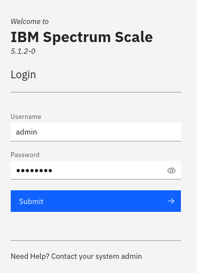

# ansible-scale-demo

Sample Ansible® playbooks to deploy a minimal IBM Spectrum Scale™ demo environment (single-node cluster, including file system). The playbooks are tailored to work with virtual machine images hosted on the [IBM Solutions Cloud for Enablement and Co-Creation (CECC)](https://www.ibm.com/partnerworld/systems/power/cecc-overview), but can be adjusted for other environments — see [Scope](#scope) for details. The project uses the official [Spectrum Scale deployment](https://github.com/IBM/ibm-spectrum-scale-install-infra) repository.

## Getting Started

1. Clone the repository, including submodules:

   ```shell
   $ git clone --recurse-submodules https://github.com/IBM/ansible-scale-demo.git
   ```

   Note that this project repository uses [Git submodules](https://git-scm.com/book/en/v2/Git-Tools-Submodules), hence you'll need to add the `--recurse-submodules` option.

2. Change your working directory to the cloned repository:

   ```shell
   $ cd ansible-scale-demo/
   ```

3. Adjust the configuration:

   ```shell
   $ vi config
   ```

   -  Enter the IP address of your target host (top of the file):

      ```ini
      ...
      node1 ansible_host=<your IP address>
      ...
      ```

   -  Optionally, enter the desired username and password for logging in to the Graphical User Interface (GUI) (bottom of the file):

      ```ini
      ...
      scale_gui_admin_user=<your username>
      scale_gui_admin_password=<your password>
      ...
      ```

4. Generate a new SSH key pair to be used to log in to your target host:

   ```shell
   $ ssh-keygen
   ```

   Simply press <kbd>ENTER</kbd> on all prompts to accept default values.

5. Authorize the SSH key with your target host:

   ```shell
   $ ssh-copy-id cecuser@<your IP address>
   ```

   You will be prompted to enter the password for your target host.

6. Verify that you can now log in to your target host without being prompted for a password:

   ```shell
   $ ssh cecuser@<your IP address> date
   ```

7. If the previous command succeeds — without prompting you for a password — then you can run the Ansible playbook to deploy the Spectrum Scale demo environment onto your target host:

   ```shell
   $ ansible-playbook -i config playbook.yml
   ```

   The playbook will run for approximately 10-15 Minutes.

8. After the Ansible playbook has completed successfully, you can log in to the Graphical User Interface (GUI) of your Spectrum Scale demo environment by opening the following URL in a web browser:

   ```url
   https://<your IP address>/
   ```

   Use the username and password you had entered into the `config` file (default: _admin_ / _password_):

   

9. Optionally run the `gpfsperf.yml` playbook to generate load on the demo environment:

   ```shell
   $ ansible-playbook -i config gpfsperf.yml
   ```

   The playbook will run for approximately 20 Minutes.

   While the playbook is running, switch back to your web browser and navigate to Monitoring → Statistics. Click on 'Customize chart' (three dots in the top right corner) and select the following performance metrics:

   - Resource type: _IBM Spectrum Scale client_
   - Aggregation level: _File System_
   - Name: _gpfs01_
   - Metrics: _Bytes Read_, _Bytes Written_

   Finally, click 'Apply' to update the chart and click '5 minutes' (bottom right) to visualize performance in real-time. You should see output similar to this:

   

   Other noteworthy panels to explore:

   - Monitoring → Dashboard
   - Nodes → select node → View Details
   - Files → File Systems

## Scope

The file `playbook.yml` is used to bootstrap a minimal IBM Spectrum Scale™ demo environment:

- Install required packages and their dependencies
- Create single-node cluster
- Create and mount file system
- Initialize Graphical User Interface (GUI)

The file `gpfsperf.yml` is used to create test data for generating synthetic load on the demo environment.

Playbooks are tailored to work with Red Hat® Enterprise Linux® images hosted on [IBM Solutions Cloud for Enablement and Co-Creation (CECC)](https://www.ibm.com/partnerworld/systems/power/cecc-overview). This includes the following characteristics:

- Non-root account for logging in (`ansible_user`), sudo usage for gaining root privileges (`ansible_become`)
- Permit local root logins to avoid sudo-wrapper configuration (`PermitRootLogin without-password` for local connections)
- Workarounds for dynamic hostnames (`node1` IP alias, additional invocation of `mmchnode --perfmon`)

The configuration can be adjusted to support other platforms as well, including a virtual machine on your laptop. Refer to the [Spectrum Scale FAQ](https://www.ibm.com/docs/en/STXKQY/gpfsclustersfaq.html) for details on supported combinations. You may need to change variable definitions in the `config` file, and/or define additional variables. Refer to the official [Spectrum Scale deployment](https://github.com/IBM/ibm-spectrum-scale-install-infra) project for details.

## Prerequisites

IBM Spectrum Scale™ installation packages are required by this project — they need to be downloaded separately. Location of the self-extracting archive is specified with the `scale_install_localpkg_path` variable.

There are different options for obtaining installation packages:

- A free trial version is available for non-production use. Visit https://www.ibm.com/products/spectrum-scale and click 'Try free developer edition'.

- Customers who have previously purchased Spectrum Scale can obtain entitled versions. Visit https://www.ibm.com/support/fixcentral and search for 'IBM Spectrum Scale (Software defined storage)'.

## Copyright & License

Copyright IBM Corporation 2021, released under the terms of the [Apache License 2.0](LICENSE).
